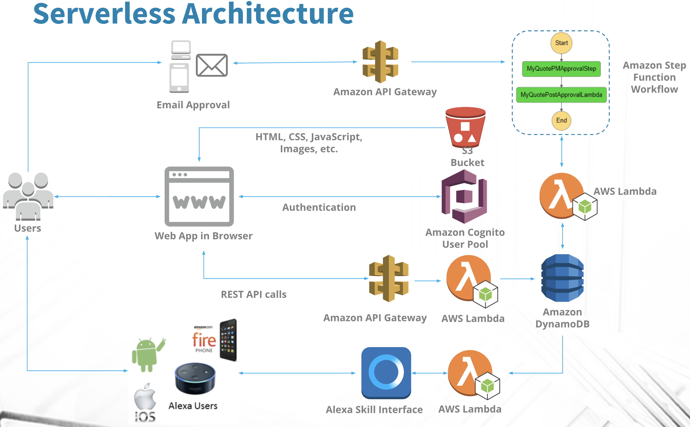
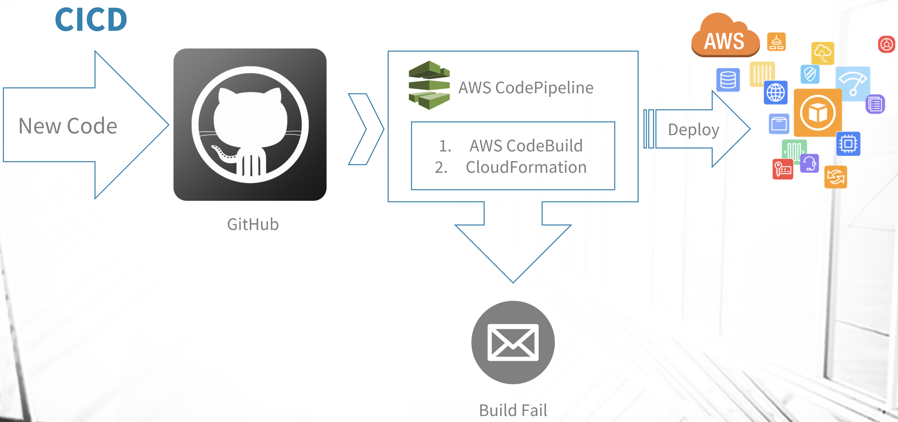

# Serverless Web Application with approval in Step function on AWS. Alexa Skill to check status.

A Serverless AWS app with step function approval workflow. It utilizes a fully serverless architecture:

 - Cognito User Pools for authentication, registration, and confirmation
 - Step Function for workflow approval
 - AWS ML for prediction
 - API Gateway for REST API authenticated with Cognito User Pools
 - Lambda and DynamoDB as a Backend
 - CloudFormation and SAM for Infrastructure management

## AWS Architecture Diagram
 
AWS Architecture 

 
Amazon Machine Learning is used to predict the appropriate quote for the user according to previously approved quotes. The CSV file containing the previously approved quotes is stored in an Amazon S3 bucket which is loaded into Amazon Machine Learning. Then, Amazon Machine Learning performs the Real-Time Bayesian prediction algorithm using the previously approved quotes and displays the result of the prediction to the screen. 
AWS ML Diagram 

 
CICD Diagram
 

 

## Application Highlights
* Online Quote submission capability 
* Quote approval workflow in cloud
* Email approval
* Alexa Support
* Price prediction using ML
* Reporting Dashboard using AWS QuickSight
* SSO – Amazon Cognito
* CICD

## Prerequisites

You need to install following on your computer or in cloud.

* [Git](https://git-scm.com/)
* Visual Studio Code
* [Node.js](https://nodejs.org/) (with NPM)
* [Bower](https://bower.io/)
* [AWS CLI](https://aws.amazon.com/cli)
* [Ember CLI](https://ember-cli.com/)
* AWS account

## Installation

* `git clone`
* `cd client`
* `npm install && bower install`

## Creating the AWS Infrastructure

***Please NOTE: the following steps will incur charges on your AWS account, please see the appropriate pricing pages for the services***

Set up AWS infra
   

## Running / Development

* `ember serve`
* Visit your app at [http://localhost:4200](http://localhost:4200).

### Code Generators

Make use of the many generators for code, try `ember help generate` for more details

### Running Tests

* `ember test`
* `ember test --server`

### Building

* `ember build` (development)
* `ember build --environment production` (production)

### Deploying the Web Application

Build the ember app and copy it to S3, note you'll need the "WebsiteBucket" output value from the above hosting cloudformation stack you generated. If you need it again, just run `aws cloudformation describe-stacks --stack-name ember-serverless-hosting` *if you used a different name, substitute that in-place of "ember-serverless-hosting", then note the `OutputValue` for "WebsiteBucket" and use that here:

    cd client
    ember build
    aws s3 sync dist/ s3://<<your-ember-website-bucket>>/ -acl public-read

Once synced you can visit the URL for your S3 bucket using the `OutputValue` from the hosting template for `WebsiteURL`.

## Further Reading / Useful Links

* [ember.js](http://emberjs.com/)
* [ember-cli](https://ember-cli.com/)
* [aws-cli](https://aws.amazon.com/cli)
* Development Browser Extensions
  * [ember inspector for chrome](https://chrome.google.com/webstore/detail/ember-inspector/bmdblncegkenkacieihfhpjfppoconhi)
  * [ember inspector for firefox](https://addons.mozilla.org/en-US/firefox/addon/ember-inspector/)
# Ember client side app with SSO, API Gateway, Lambda and DynamoDB
# easyquote-aws-serverless
